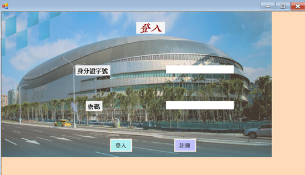

# Ticket-System
資料庫期末專案(團體)-大巨蛋訂票系統

## 🔧 使用技術
- Visual Studio
- C#
- Windows Forms
- MS SQL Server

## 👩‍💻 個人負責內容
- 負責使用者登入與註冊功能開發，並使用 Windows Forms 設計操作介面
- 串接 MS SQL Server 資料庫，依使用者輸入的身分證 ID 查詢帳號資料並進行登入驗證
- 使用 SHA-256 搭配 Salt 進行密碼雜湊處理，提高帳號密碼儲存與驗證的安全性
- 使用參數化 SQL Query 進行資料查詢，降低 SQL Injection 風險
- 完成登入成功後導向系統主畫面，以及登入失敗訊息提示等操作流程
  
程式碼:
using System;
using System.Collections.Generic;
using System.ComponentModel;
using System.Data;
using System.Drawing;
using System.Linq;
using System.Text;
using System.Threading.Tasks;
using System.Windows.Forms;
using System.Security.Cryptography;
using System.Data.SqlClient;
using static System.Windows.Forms.VisualStyles.VisualStyleElement;
using 訂票系統_訂票紀錄;
using 演出資訊;

namespace Register_Logins
{

    public partial class logins : Form
    {

        //宣告物件from1為From1
        Register Register = new Register();
        Lobby Lobby = new Lobby();
        SqlConnection sqlconn;
        SqlCommand sqlcommand;
        SqlDataReader sqldatareader;
        byte[] password;
        byte[] salt;

        System.Security.Cryptography.SHA256 HASH = SHA256.Create();
        public logins()
        {
            InitializeComponent();
        }

        private void button2_Click(object sender, EventArgs e)
        {
            Register.ShowDialog();
        }

        private void button1_Click(object sender, EventArgs e)
        {
            sqlconn = new SqlConnection("Data Source=YOU_ZHEN\\EXPRESS2022;Initial Catalog = BIGEGG; Integrated Security = true");
            sqlconn.Open();
            sqlcommand = new SqlCommand("select [身分證ID],[姓名],[電子郵件],[PassSalt],[電話],[Salt] FROM [BIGEGG].[dbo].[使用者] Where [身分證ID]=@身分證ID", sqlconn);
            sqlcommand.Parameters.Add("@身分證ID", SqlDbType.NVarChar);
            sqlcommand.Parameters["@身分證ID"].Value = textBox1.Text;
            sqldatareader = sqlcommand.ExecuteReader();
            sqldatareader.Read();

            byte[] source = Encoding.Default.GetBytes(textBox2.Text.Trim());
            salt = Convert.FromBase64String(sqldatareader[5].ToString());
            byte[] passhash = source.Concat(salt).ToArray();
            byte[] crypto = HASH.ComputeHash(passhash);
            string PasswordHash = Convert.ToBase64String(crypto);
            string oldPasswordHash = sqldatareader[3].ToString();

            if (PasswordHash == oldPasswordHash)
            {
                this.Hide();
                Lobby.ShowDialog();
                this.Close();
            }
            else
            {
                MessageBox.Show("登入失敗");
            }
            sqldatareader.Close();
        }
    }
}

## 📊 畫面展示

